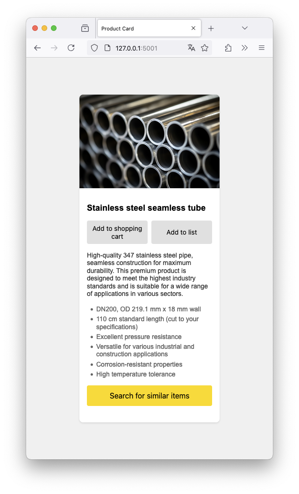

# fh-snippets
Snippets, tests and ideations in FastHTML

## Product preview card

Render a custom styled card with some product information (using plain CSS) and an image. Would be filled from a db or CMS in a production setting, this example uses a small dataclass to mimic the behaviour in a self-contained manner.

